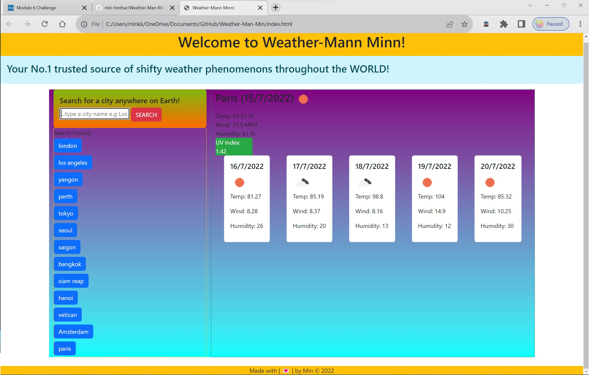

# Project Title [Weather-Man-Min]

-----

## Table of Contents
1. [Description](#description)
2. [Installation](#installation)
3. [Usage](#usage)
4. [Contributing](#contributing)
5. [Tests](#tests)
6. [License](#license)
7. [Questions](#questions)

-----

### Description 
Created a weather dashboard designed for weary travelers to plan their trips to cities of their choosing. Uses the Open Weather One Call API to retrieve weather data for cities and Bootstrap Cards for CSS styling.

-----

### Installation Req
JQuery, Bootstrap, Popper, Luxon, OpenWeather API

-----

### Usage 
User Story
AS A traveler
I WANT to see the weather outlook for multiple cities
SO THAT I can plan a trip accordingly

Acceptance Criteria
GIVEN a weather dashboard with form inputs
WHEN I search for a city
THEN I am presented with current and future conditions for that city and that city is added to the search history
WHEN I view current weather conditions for that city
THEN I am presented with the city name, the date, an icon representation of weather conditions, the temperature, the humidity, the wind speed, and the UV index
WHEN I view the UV index
THEN I am presented with a color that indicates whether the conditions are favorable, moderate, or severe
WHEN I view future weather conditions for that city
THEN I am presented with a 5-day forecast that displays the date, an icon representation of weather conditions, the temperature, the wind speed, and the humidity
WHEN I click on a city in the search history
THEN I am again presented with current and future conditions for that city

-----

### Contributing 
YES 

-----

### Tests 
Insomnia

-----

### License 
MIT 

-----

### Questions 

#### GitHub Username: min-hinthar 

#### GitHub URL: https://github.com/min-hinthar

#### GitHub Repo: https://github.com/min-hinthar/Weather-Man-Min/

#### Email: min@hintharinc.com

-----

